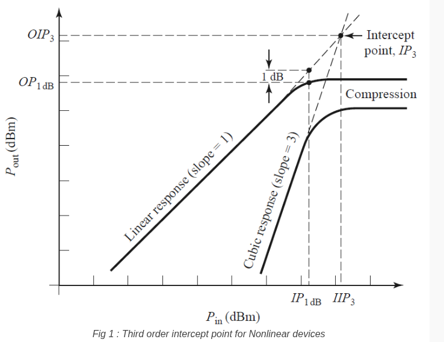
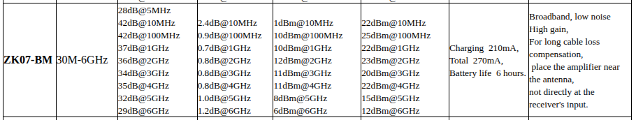
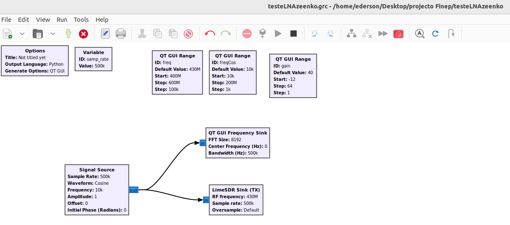
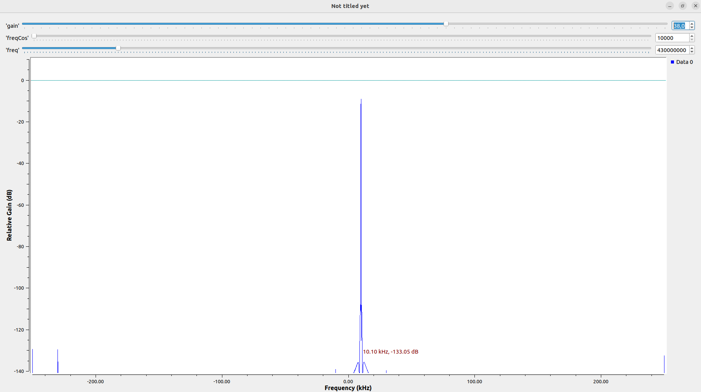
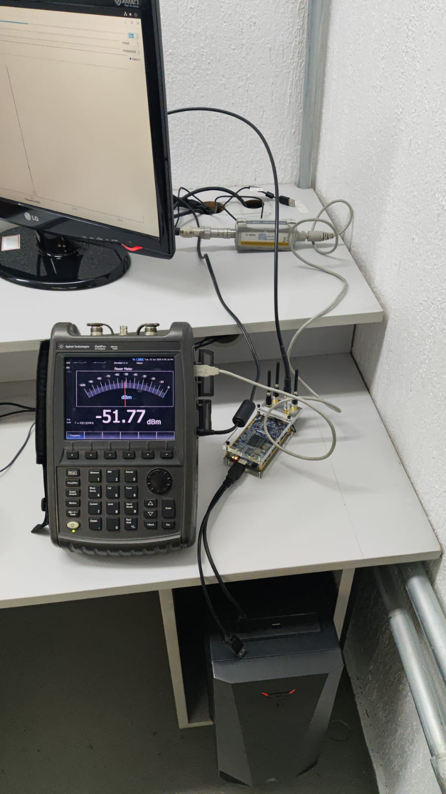
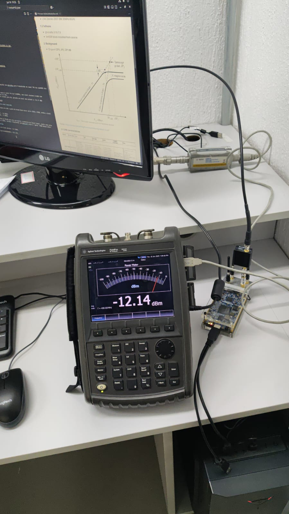

# Teste do LNA zeenko
Objectivo: verificar ganho de potencia em 433MHz

## 1. Materiais

### 1.1 Hardware  

- 01 Agilent FieldFox RF analyser N9912A6 GHz.
- 01 Agilent U2001A USB average Power Sensor.
- 01 Lime SDR.   
- 01 Atenuador 30dB minicircuits.
- 01 Cabo SMA-M NM ~1m.
- 01 adaptador MF MF.
- 01 adaptador SMA-M SMA-M. 
- LNA Zeenko ZK07-BM 30MHz-6GHz. 

### 1.2 Sofware
- gnuradio 3.10.7.0
- limSDR block instalado from source (OOT)
  
## 2. Background 

 - O que é OIP3, IP3, OP1dB 

fonte: https://www.everythingrf.com/community/what-is-ip3 

### 2.1 LNA Zeenko características 

fonte: https://www.zeenko.tech/lna-modules

  

## 3. Teste

Setup: 

Inicialmente configurado programa com gnuradio para transmissão no canal TX1 do LimeSDR zin:

- A frequencia utilizada para o teste foi de f=430MHz, com sinal cosseno criado com fcos=10kHz e sample_rate= 0.5 MHz.
  
- O ganho do LimeSDR foi setado para 38, gerando um sinal com potência estável a -51.77 dBm  

### 3.1 Potencia do sinal esperado

De acordo com a tabela do LNA o ganho do mesmo deve estar entre 37dB a 42dB, então o sinal esperado é de:

$S_min=-51,7+37 - 14.7dBm$.    
$S_min=-51,7+42 - 9.7dBm$.  

$$ -14.7\ dBm \leq S \leq -9.7 \ dBm $$
Notar a questão do PO1dB para não extrapolar a potencia da faixa linear, neste caso esta entre 10dBm e 12dBm, estamos trabalhando com possivel sinal à  aprox -20dB desse valor.  

### 3.2 Resultado

Potencia do sinal obtido: 
$$S= -12.14 \ dBm$$ 

Ganho aproximado @430MHz = 39.5 dB 

### 3.3 Conclusões

**O LNA funcionou como esperado para @430~MHz com ganho aproximado de 39dB.**

ok 

